## The Ontario Sunshine List

<!-- What is it?  -->
<!-- Break-Down - General -->

### 2020 in Summary

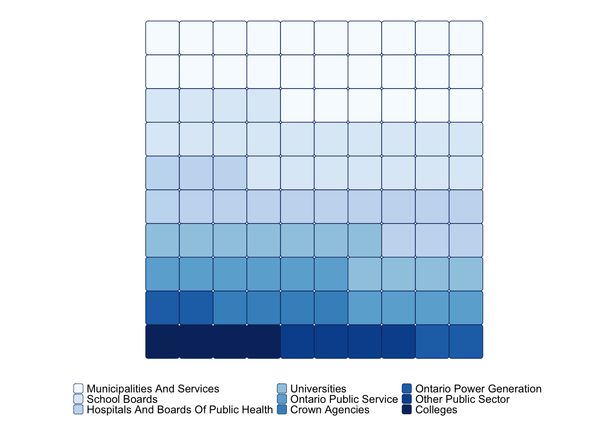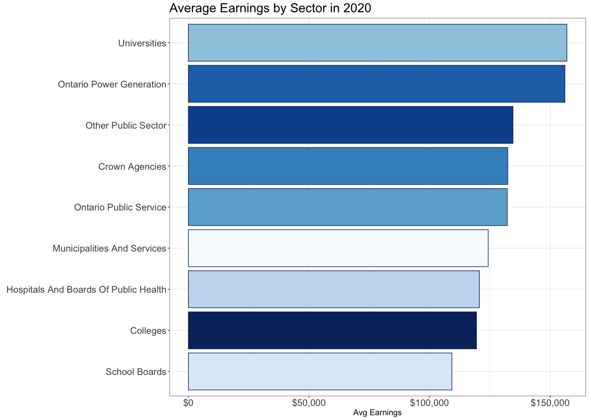

### Change from 2019 to 2020

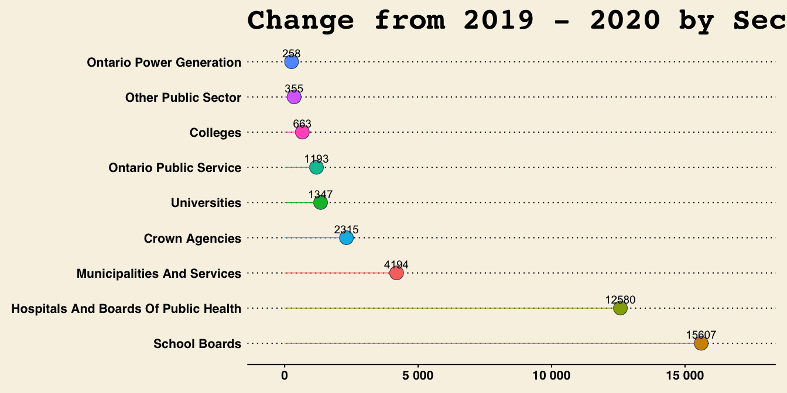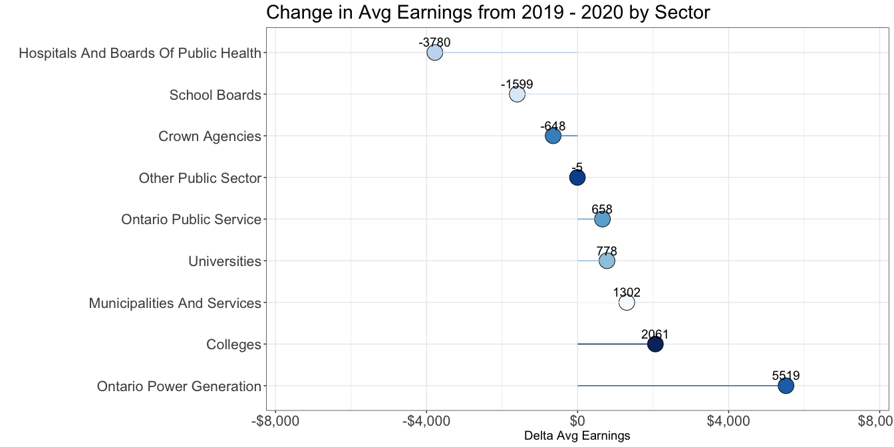

### What About Job Titles

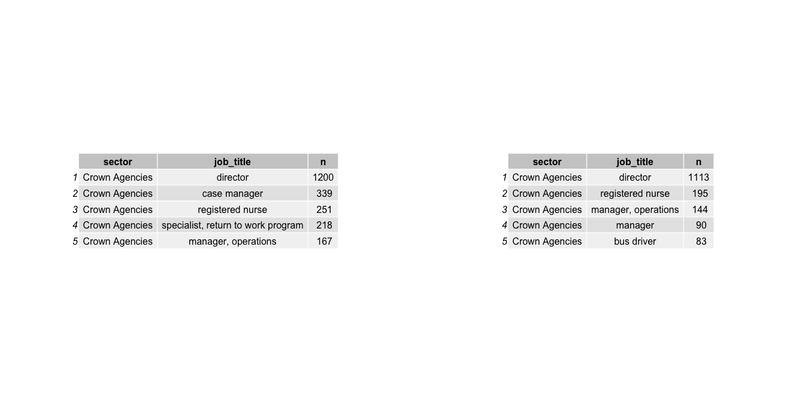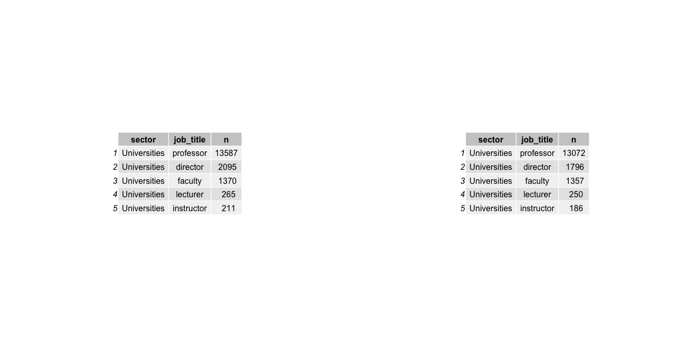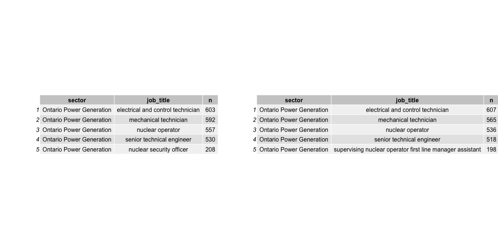

### Summary Across Time

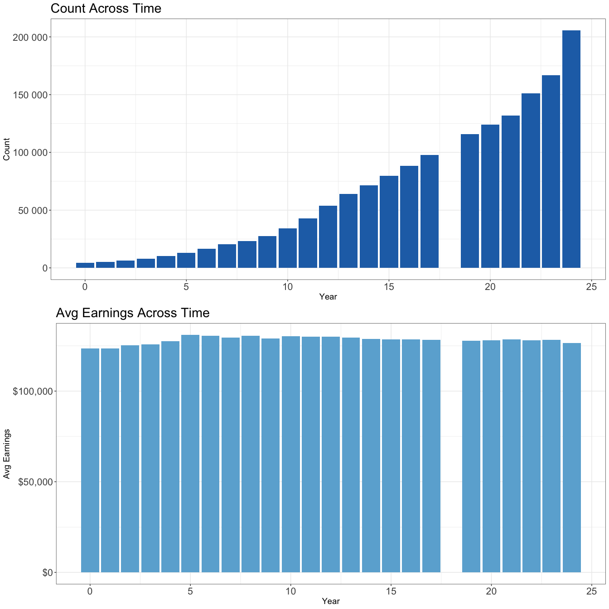

### Sector Summary Across Time

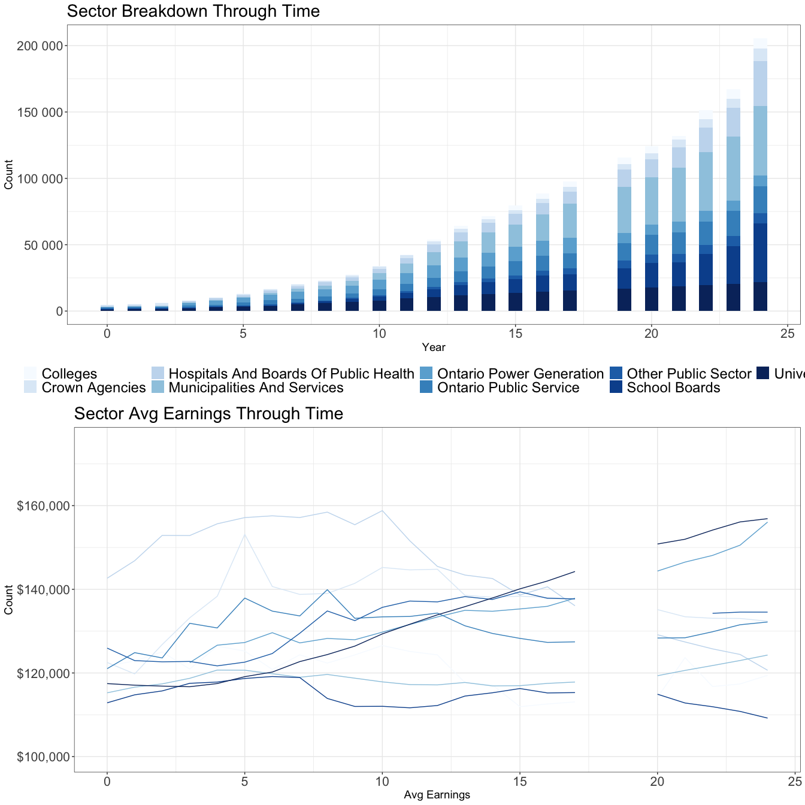

## What About Inflation

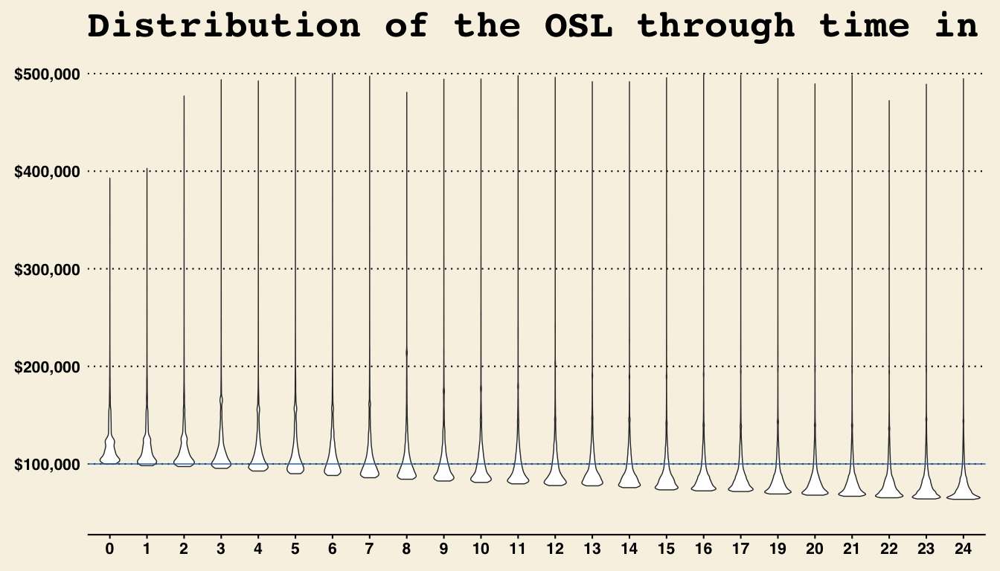

### 2020 Adjusted

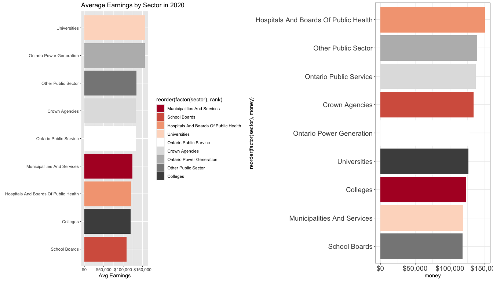

### Managers versus Professionals

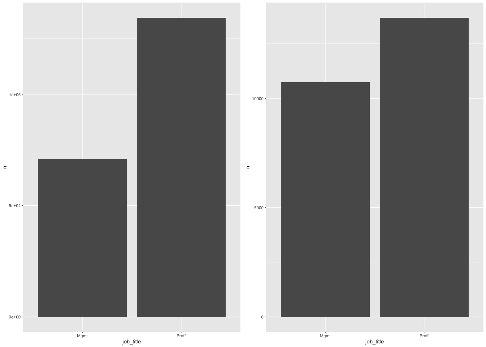

### Change from 2019 to 2020 - Adjusted

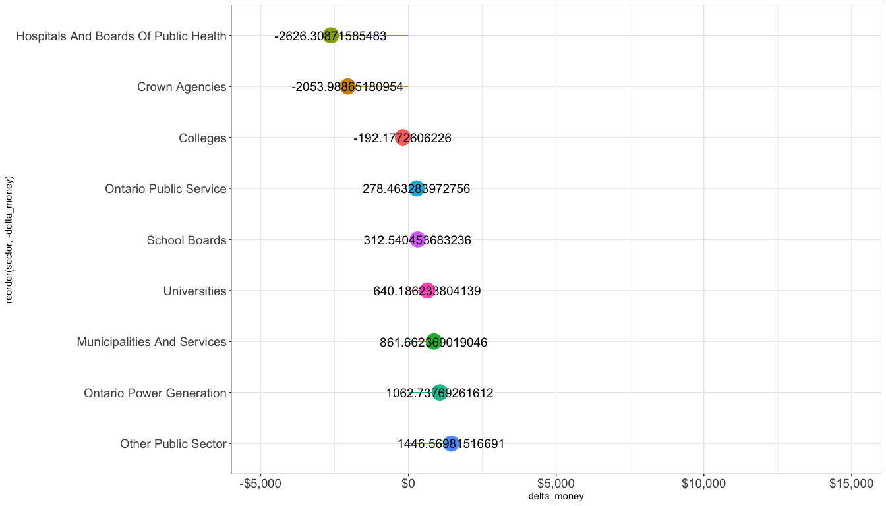

### Adjusted Job Titles

### Summary Across Time - Adjusted

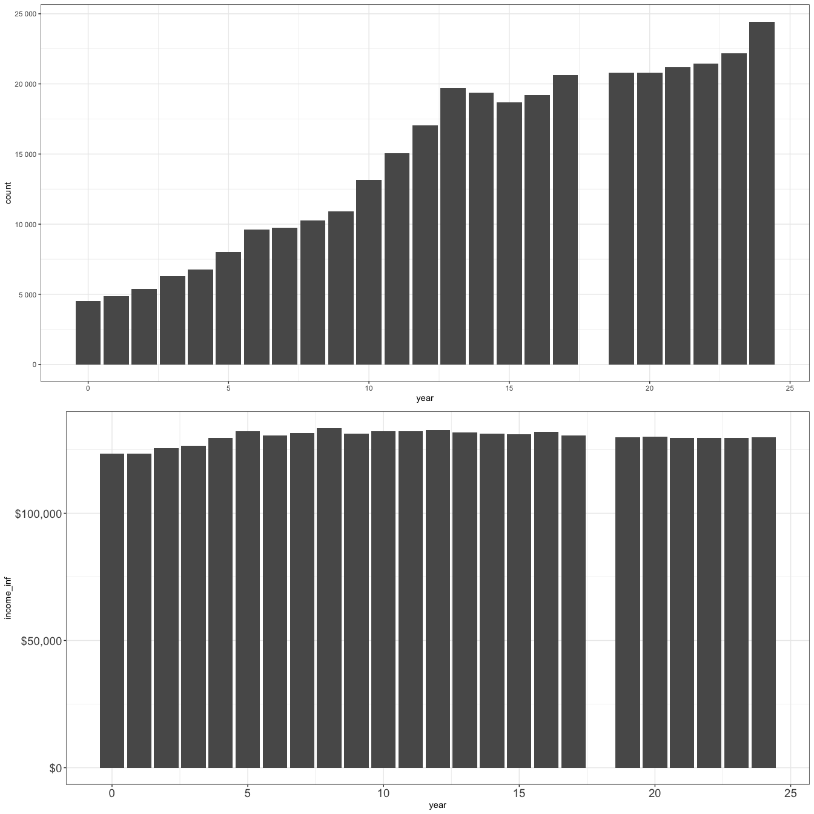

### Sector Summary Across Time - Adjusted

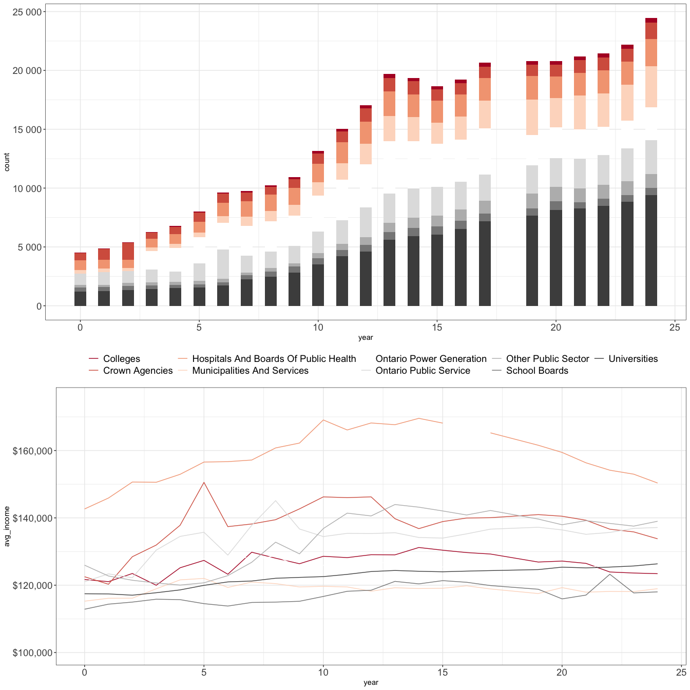
