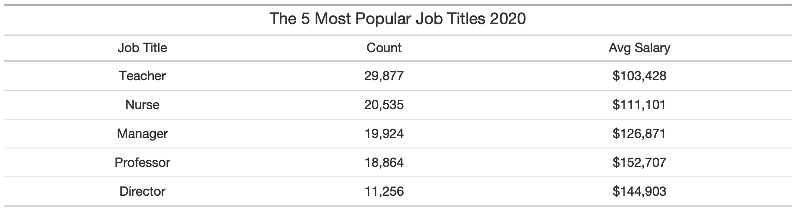

```{r setup, include=FALSE}
knitr::opts_chunk$set(echo = TRUE)
```

```{r setup2, echo=FALSE, message=FALSE, warning=FALSE}
# library(knitr)
# library(kableExtra)
library(tidyverse)


# source(file = "0_get_data.R", local = TRUE)       # Only uncomment on first run 
source(file = "code/functions.R", local = TRUE)
source(file = "1_process_data.R", local = TRUE)
# source(file = "2_plot_data.R", local = TRUE)      # Only uncomment on first run
source(file = "3_model_data.R", local = TRUE)

# Report Variables 

# Count and Avg Sal 1996
master_96 = master %>% filter(year==0)
count96 = prettyNum(nrow(master_96), big.mark = ",")
salavg96 = paste("$", prettyNum(mean(master_96$salary), big.mark = ","), sep = "")


# Count and Avg Sal 2020
count20_n = nrow(master_20)
count20 = prettyNum(count20_n, big.mark = ",")
salavg20_n = mean(master_20$salary)
salavg20 = paste("$", prettyNum(salavg20_n, big.mark = ","), sep = "")

# Count and Avg Sal 2019
count19_n = nrow(master_19)
salavg19_n = mean(master_19$salary)

# Count and Avg Sal Change 19-20
chg1920_n = count20_n - count19_n
chg1920 = prettyNum(chg1920_n, big.mark = ",")
chg1920_d = paste("$", prettyNum(-salavg20_n+salavg19_n, big.mark = ","), sep = "")

# Average salary accross years
salavg =  paste("$", prettyNum(mean(master$salary), big.mark = ","), sep = "")

```

# 2020 Drastically Increased the Number of People on the Ontario Sunshine List

## An analysis of Ontario Public Sector's "Highest" Earners

## Summary (Issue)

-   The 2020 Ontario Sunshine List was released on March 19th 2021. It reported a total of `r count20` members, out of which `r chg1920` were new, or an increase of `r round((count20_n-count19_n)/count19_n*100, digits = 0)`%.

-   While the list has expanded every year, this year's growth was significantly larger than what the trend predicted.

-   Led by nurses and teachers, the higher-than-expected increase can be explained by a major compensation agreement in early 2020 and the government's efforts to combat the pandemic.

## This Report

What follows is a descriptive analysis of the Ontario Sunshine List. The main section is my attempt to shed some light on the effects of 2020 on Ontario's high earners. Appendix A considers what would happen if the list's cut-off salary was adjusted for inflation and Appendix B includes other descriptive statistics that were not relevant to the research question. The project is intended to be fully reproducible. If you're interested in replicating or improving this analysis see the README file to get started.

## What is the OSL (Background)

A *sunshine list* is the name commonly given to the public disclosure of employee compensation. In 1996, then premier Mike Harris, introduced the first Ontario Sunshine List, intending to disclose the salaries and benefits of all employees on the provincial government payroll who were considered high earners. Setting the floor at a salary of \$100,000, the province reported `r count96` high earners that year, with an average salary of `r salavg19_n`. Dictated by the Public Sector Salary Disclosure Act (1996), the government has required ever since that organizations that receive public funding from the Province of Ontario disclose by March 31 the names, positions, salaries and total taxable benefits of employees paid \$100,000 or more in a calendar year.

### Uninterrupted Growth

The number of people in the Ontario Sunshine List has increased with every release since its conception 25 years ago. It was twice as big by 2000, ten times by 2008, and today the list is 45 times larger than in 1996. Regardless, the yearly average earnings have remained mostly constant around `r salavg`, likely because increasing existing salaries are compensated by new additions to the list, most of which earn a salary close to the floor.


### Recorded by Government Sector

The data provided is categorized by government sector. While these sectors change slightly year-to-year as a result of administrative changes and operational restructuring (See Appendix B for a full list), we can functionally group all employees reported in 9 independent sectors. The following figure shows the number of people in the list through time divided by sector.

While the size of sectors vary, Municipalities, School Boards, Hospitals, and Universities, have captured the lion share of high earners for most of the lists existence.


## 2020 in Review (Context)

The last release of the OSL reported an increase in members by a total of `r chg1920` members and a reduction in the average salary of `r chg1920_d`.

### Municipalities, School-Boards and Hospitals

Municipalities, School-Boards, and Hospitals, top the share of high earners in 2020 by a significant margin, making-up almost two thirds of the total.


```{r}
salavg_mun_a = master_20 %>% filter(sector=="Municipalities And Services")
salavg_mun = paste("$", prettyNum(mean(salavg_mun_a$salary), big.mark = ","), sep = "")

salavg_sch_a = master_20 %>% filter(sector=="School Boards")
salavg_sch = paste("$", prettyNum(mean(salavg_sch_a$salary), big.mark = ","), sep = "")

salavg_hos_a = master_20 %>% filter(sector=="Hospitals And Boards Of Public Health")
salavg_hos = paste("$", prettyNum(mean(salavg_hos_a$salary), big.mark = ","), sep = "")
```


**Municipalities**

-   Police constables (\$118k), managers (\$129), and firefighters ($117k), made up almost a third of the job titles in Municipalities in 2020. 

-  The average salary was `r salavg_mun`. The highest paid positions were Chief of Police (\$481k), Chief of Police (\$436k), and City Planner (\$387k). 

All sectors saw the number of people making over \$100k increase, but it was School Boards and Hospitals that saw the biggest change.

**School Boards**

-   Teachers (\$103k) dominated the School Board sector in 2020, making up 97% of jobs in the list.  

-   The average salary was `r salavg_sch`. The highest paid positions were Legal Counsel (\$382k), Director (\$334k), and Director (\$316k). 

**Hospitals**

-   The list was topped by Nurses (\$110k), followed by Managers (\$116) , and Directors (\$148k)

-   The average salary was `r salavg_hos`. The highest paid positions were President and CEO (\$845k), President and CEO (\$776k), and President and CEO (\$733k). 


### Job Titles

Teachers and nurses topped the list as the most popular jobs in the Ontario Sunshine List of 2020. The best paying jobs in contrast went mostly to Ontario Power Sector with President and CEO (\$1.22M), President Nuclear (\$1.13M), and CEO/Chief Nuclear Officer (\$901k) as the top 3.



## A Recession with Unparalleled Growth (Analysis)


### Overall growth higher than expected


### The Culprits


## Conclusion

There is only so much we can extrapolate from this limited information. While we can conclude that the increase observed was higher than normal, and this was due to very large increases in the number of teachers and nurses, it is impossible to determine whether the decisions behind such changes were appropriate, successful, or efficient. 

Many argue that the list’s floor should be raised according to inflation (see Appendix A), whereas other countries like BLAH have opted for full transparency in the public sector. It is clear that the cut-off, as it exists now, does more to confuse than clarify. $100k dollars, while far from the median ( ), covers too broad of a stroke to facilitate insights on the highest earners, but too narrow to attempt to investigate broad changes in the public sector. In fact, most of the reporting that follows the list’s release, focuses seldomly on the individuals earning the highest salaries. This is important information, but one that fails to give us any valuable big-picture insights.

Further analysis on the OSL is welcomed, with interesting research questions like contrasting trends through time with electoral cycles or economic fluctuations.

# Appendix A - Adjusting for Inflation

The OSL is criticized for using the same cut-off at \$100K that it began with, instead of adjusting for inflation. Any analysis that intends to learn more about Ontario’s highest earners, needs to account for the difference in purchasing power between 1996 and 2020. If we were to adjust for inflation, the floor today should sit at BLAH. 

### Only 8% Remain

By adjusting all salaries to 1996 dollars, we can identify how the list would have changed in the presence of a moving floor. While the list containing all years available houses BLAH recorded salaries, when adjusting for inflation only BLAH remain, or the equivalent to BLAH. 


### Universities, Universities, Universities

The 2020 list shrinks by BLAH when adjusting for inflation, totaling only BLAH members. 

This analysis shows that at the higher cut-off, universities dominate the list and have done so for quite some time. This is likely due to the nature of the sector, where the majority of its members are professors. The average salary of an Ontario Professor is BLAH compared to nurses at BLAH and teachers at BLAH. 


### Modeling the List of Really High Earners


# Appendix B - Supplemental Information

<!-- Fig 3 shows how average earnings by sector differ from the average trend observed above. While most sectors seem to remain mostly constant between \$100K and \$150K, Universities and Ontario Power Generation have seen a generally upward sloping trend and Hospitals avg salaries have been decreasing. -->

