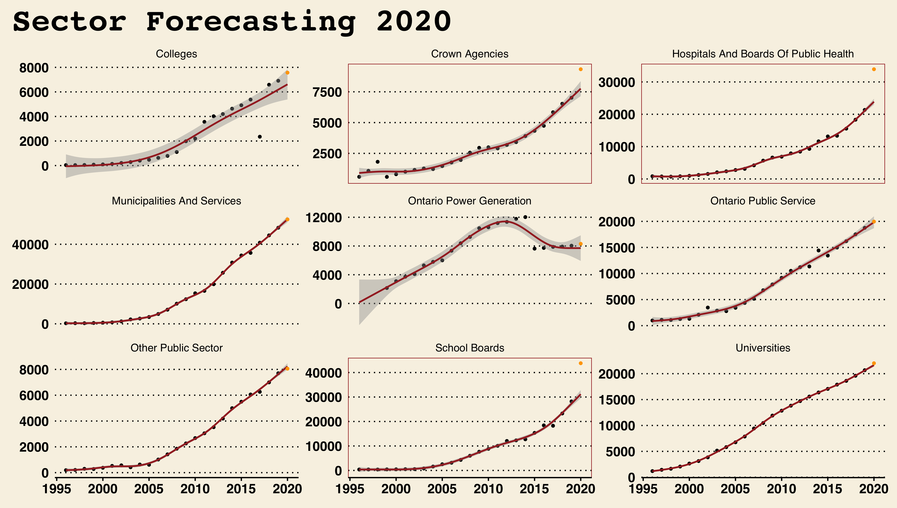
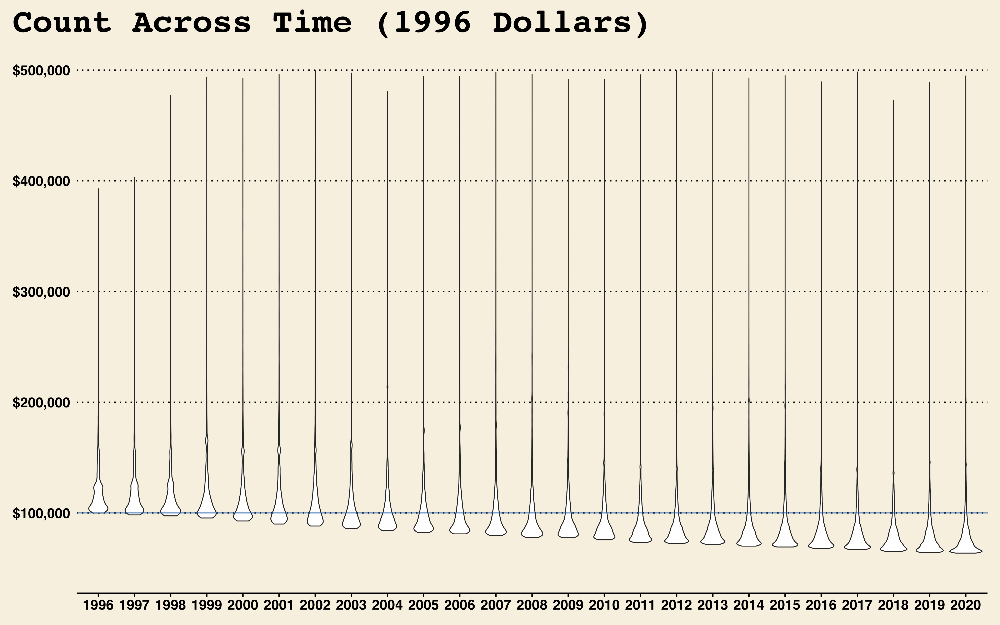

```{r setup, include=FALSE}
knitr::opts_chunk$set(echo = TRUE)
```

# It's Not What It Looks Like

## The Effect of 2020 on Ontario Public Sector's High Earners

Abstract: The Ontario Sunshine List - - reported a higher-than-projected \_\_\_\_\_ members. Facing increased debt and considering the financial effects the pandemic had on many, a narrow look at the numbers may prompt some to argue for immediate cuts. The following is a breakdown of the OSL in 2020 and through time that attempts to learn more about the source of the increase. I determined that most of the excess increase came from two sectors in particular, hospitals and schools, completely in line with a responsible response to the pandemic (regarding direction, the magnitude requires further investigation). After all, the government is responding to a health crisis first, social second, and economic last.

<!-- change to summary  -->

<!-- add db context -->

Summary:

-   A

-   B

-   C

## This Report (Issue)

-   A

## What is the OSL (Background)

A *sunshine list* is the name commonly given to the public disclosure of employee compensation (salary, benefits, severance). In 1996, then premier Mike Harris, introduced the first Ontario Sunshine List, intending to disclose the salaries and benefits of all employees on the provincial government payroll who were considered high earners. Setting the floor at a salary of \$100,000, the province reported \_\_\_\_ high earners that year, with an average salary of \_\_\_\_.

### Uninterrupted Growth

The number of people in the Ontario public sector making more than \$100k a year has increased with every release since its conception 25 years ago. It was twice as big by 2000, ten times by 2008, and today the list is 45 times larger than in 1996. Regardless, the yearly average earnings have remained mostly constant around \_\_\_\_\_, likely because increasing existing salaries are compensated by the new additions to the list, most of which earn a salary close to the floor. From Fig 1. we can already see that 2020's list saw a growth larger than the trend predicted.


### Recorded by Government Sector

The data provided is categorized by government sector. While these sectors change slightly year-to-year as a result of administrative changes and operational restructuring (See Appendix:\_\_ for a full list), we can functionally group all employees reported in 9 independent groups. Fig 2 and 3 show the number of people in the list as well as their average earnings through time divided by sector.

While the size of sectors variate, we can see from Fig 2 that Municipalities, School Boards, Hospitals, and Universities, have captured the lion share of high earners for the past five years.

 <!-- push to appendix? -->

Fig 3 shows how average earnings by sector differ from the average trend observed above. While most sectors seem to remain mostly constant between \$100K and \$150K, Universities and Ontario Power Generation have seen a generally upward sloping trend and Hospitals avg salaries have been decreasing. Further investigation is required to learn more about the cause for this trends.


## 2020 in Review (Context)

The last release of the OSL reported an increase in members by a total of $__$ members ( total) and and reduction in the average salary of $__$ ( total).

### Municipalities, School-Boards and Hospitals

Municipalities, School-Boards, and Hospitals, top the share of high earners in 2020 by a significant margin, making-up almost two thirds of the total.


All sectors saw the number of people making over \$100k increase, but it was School Boards and Hospitals that saw the biggest change.

**School Boards**

-   The share of teachers in the OLS increased by $__$, leading the sector's increase.

-   All five relevant [unions](link) agreed to new contracts in early spring 2020.

**Hospitals**

-   Similarly, it was an increase in the percentage of nurses ($__$) that can explain that drastic increase in the Hospital sector.

-   While there was no wide changes to compensation agreements, the increase can be explained by the government's response to the COVID-19 pandemic. Facing a health crisis characterized by crowded intensive care units and a need to enforce public health guidelines unto the public, the Ford government engaged in several expended recruitment bouts, attempting to increase the number of health care professionals in hospitals, schools, and long-term care homes. [source](link)


## A Recession with Unparalleled Growth (Analysis)

The absolute number of people in the list coupled with the drastic change from 2019, may raise worries about government spending. In particular amid an economic crisis, a growing OSL illustrates how government employees can get richer while many struggle to keep their jobs. However, it is important to consider the two following questions before using this information to advocate for changes.

-   Was the increase in 2020 in line with the observed growth trend?
-   Where is the increase coming from?

### Overall growth higher than expected

Using a generalized additive model (GAM) we can project what the expected growth in number of people earning more than \\\$100k would have been based solely on the observed trend. As we can see, the total number was expected to be between $__$ and \$\_\_\$. According to this model, the list saw an increase significantly larger than predicted.


### The Culprits

However, increased growth alone is not enough to warrant concerns. It is more interesting to look at where this growth is coming from. As discussed above, Hospitals and School Boards led the pack in number of new members joining the list in 2002 but, how did this growth align with the projected trend?



Nearly all sectors saw increases in line with projections. Crown Agencies, Hospitals, and School Boards, stand out with increases far above expected. Increases in Hospitals and School Boards, was led by nurses and teachers respectively. Crown Corporations saw a drastic increase in the number of nurses, bosses (managers and directors), and specialists (get back to work program).

This analysis indicates that the above-projected growth observed, its not the result of broad salary increases or financial mismanagement. Instead it illustrates the strains that 2020 imposed on the Ontario government. Starting in February, the five unions representing the teachers of Ontario negotiated a new compensation agreement with the government. Negotiations went on until April and the result did not come without friction, with teacher strikes and blah blah. Advocates argue that blah blah blah.

By April, Canada had reported \_\_\_ cases and lock-downs in blah and blah had been implemented. As the pandemic grew, the need for more nurses in hospitals and blah blah centers like long term homes was critical, and the government responded accordingly. It is very likely that the trend observed is caused by a combination of new nurses and other strains of the pandemic (increased overtime?).

While Crown Agencies make a smaller share of the list, the higher than expected growth warrant a closer look. Most of the growth seen in 2020 came from management positions like *director* and *manager*, as well as new-to-the-list job titles like *specialist, return to work program*. The pandemic has resulted in both a health and economic crises with an increased need for policy and logistics development. The growth seen in Crown Agencies in 2020 is likely a result of more management and analysts, raising to navigate the difficult terrain of operating amid a pandemic.\

## Adjusting for Inflation (Considerations)

### Only 8% Remain



### Universities, Universities, Universities


### Adjusted for Inflation... things get messy


## Conclusion

# Appendix
