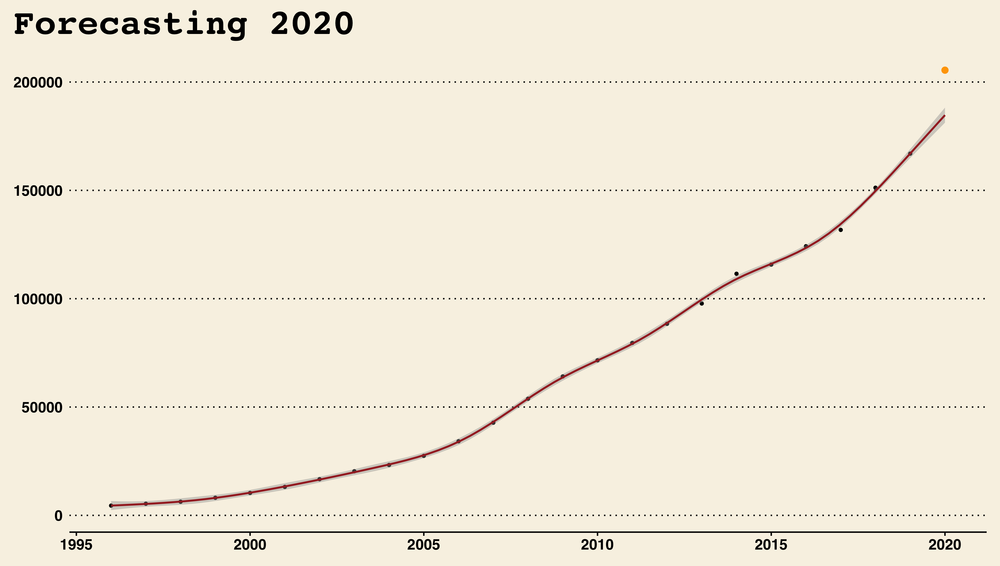
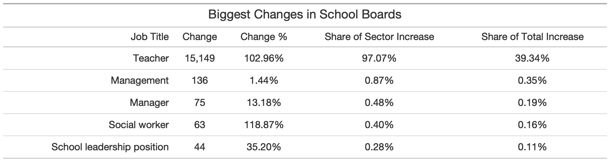
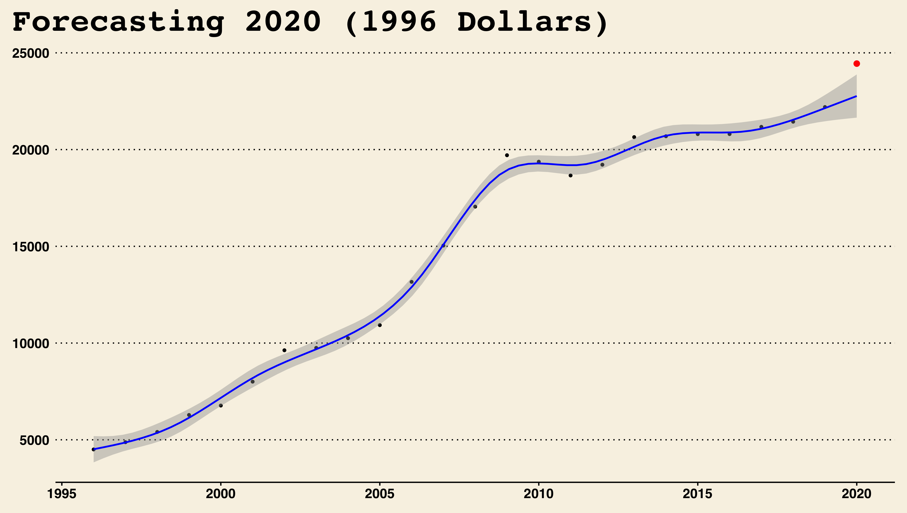

```{r setup, include=FALSE}
knitr::opts_chunk$set(echo = TRUE)
```

```{r setup2, echo=FALSE, message=FALSE, warning=FALSE}
# library(knitr)
# library(kableExtra)
library(tidyverse)
library(gt)
library(webshot)

source(file = "MakePlots.R", local = TRUE)

```

# 2020 Drastically Increased the Number of People on the Ontario Sunshine List

## An analysis of Ontario Public Sector's "Highest" Earners

## Summary (Issue)

-   The 2020 Ontario Sunshine List was released on \_\_\_\_\_. It reported over 200,000 people, out of which $__$ were new, or an increase of \$\_\_\$.

-   While the list has expanded every year, this year's growth was significantly larger than what the trend predicted.

-   Led by nurses and teachers, the higher-than-expected increase can be explained by a major compensation agreement in early 2020 and the government's efforts to combat the pandemic.

## This Report

What follows is a descriptive analysis of the Ontario Sunshine List. The main section is my attempt to shed some light on the effects of 2020 on Ontario's high earners. Appendix A considers what would happen if the list's cut-off salary was adjusted for inflation and Appendix B includes other descriptive statistics that were not relevant to the research question. The project is intended to be fully reproducible. If you're interested in replicating or improving this analysis see the Read Me file to get started.

## What is the OSL (Background)

A *sunshine list* is the name commonly given to the public disclosure of employee compensation. In 1996, then premier Mike Harris, introduced the first Ontario Sunshine List, intending to disclose the salaries and benefits of all employees on the provincial government payroll who were considered high earners. Setting the floor at a salary of \$100,000, the province reported \_\_\_\_ high earners that year, with an average salary of \_\_\_\_. Dictated by the Public Sector Salary Disclosure Act (1996), the government has required ever since that organizations that receive public funding from the Province of Ontario disclose by March 31 the names, positions, salaries and total taxable benefits of employees paid \$100,000 or more in a calendar year.

### Uninterrupted Growth

The number of people in the Ontario public sector making more than \$100k a year has increased with every release since its conception 25 years ago. It was twice as big by 2000, ten times by 2008, and today the list is 45 times larger than in 1996. Regardless, the yearly average earnings have remained mostly constant around \_\_\_\_\_, likely because increasing existing salaries are compensated by the new additions to the list, most of which earn a salary close to the floor.


### Recorded by Government Sector

The data provided is categorized by government sector. While these sectors change slightly year-to-year as a result of administrative changes and operational restructuring (See Appendix:\_\_ for a full list), we can functionally group all employees reported in 9 independent sectors. The following figure shows the number of people in the list through time divided by sector.

While the size of sectors vary, Municipalities, School Boards, Hospitals, and Universities, have captured the lion share of high earners for most of the lists existence.


## 2020 in Review (Context)

The last release of the OSL reported an increase in members by a total of $__$ members ( total) and and reduction in the average salary of $__$ ( total).

### Municipalities, School-Boards and Hospitals

Municipalities, School-Boards, and Hospitals, top the share of high earners in 2020 by a significant margin, making-up almost two thirds of the total.


All sectors saw the number of people making over \$100k increase, but it was School Boards and Hospitals that saw the biggest change.

**School Boards**

-   The share of teachers in the OLS increased by $__$, leading the sector's increase.

-   All five relevant [unions](link) agreed to new contracts in early spring 2020.

**Hospitals**

-   Similarly, it was an increase in the percentage of nurses ($__$) that can explain that drastic increase in the Hospital sector.

-   While there was no wide changes to compensation agreements, the increase can be explained by the government's response to the COVID-19 pandemic. Facing a health crisis characterized by crowded intensive care units and a need to enforce public health guidelines unto the public, the Ford government engaged in several expended recruitment bouts, attempting to increase the number of health care professionals in hospitals, schools, and long-term care homes. [source](link)


```{r top5, echo=FALSE, message=FALSE, warning=FALSE}

top_5_jobs = top_10_jobs %>% 
  slice(1:5)

top_5_jobs = top_5_jobs %>% mutate(job_title = stringr::str_to_sentence(job_title))

# top_5_jobs %>% kbl() %>%  kable_minimal(bootstrap_options = c("striped", "hover"))
top_5_table = top_5_jobs %>% gt() %>%
  fmt_number(columns = vars(n), decimals = 0) %>%
  fmt_currency(columns = vars(mean_sal), currency = "USD",, decimals = 0) %>%
  tab_header(
    title = md("The 5 Most Popular Job Titles 2020")) %>%
  cols_label(
    job_title = md("**Job Title**"),
    n = md("**Count**"), 
    mean_sal = md("**Avg Salary**")) %>% 
  tab_options(table.width = pct(50)) %>% 
  cols_align(align = "center") 

top_5_table %>% gtsave(filename = "top_5_table.png", path="tables/") 

```

### Job Titles

[Top 5 Job Titles](tables/top_5_table.png)

## A Recession with Unparalleled Growth (Analysis)

The absolute number of people in the list coupled with the drastic change from 2019, may raise worries about government spending. In particular amid an economic crisis, a growing OSL illustrates how government employees can get richer while many struggle to keep their jobs. However, it is important to consider the two following questions before using this information to advocate for changes.

-   Was the increase in 2020 in line with the observed growth trend?
-   Where is the increase coming from?

### Overall growth higher than expected

Using a generalized additive model (GAM) w/ poisson we can project what the expected growth in number of people earning more than \\\$100k would have been based solely on the observed trend. As we can see, the total number was expected to be between $__$ and \$\_\_\$. According to this model, the list saw an increase significantly larger than predicted.



### The Culprits

However, increased growth alone is not enough to warrant concerns. It is more interesting to look at where this growth is coming from. As discussed above, Hospitals and School Boards led the pack in number of new members joining the list in 2002 but, how did this growth align with the projected trend?


```{r changeJobs, echo=FALSE, message=FALSE, warning=FALSE}

jobs = dd_delta %>% filter(sector %in% c("Crown Agencies",
                                         "Hospitals And Boards Of Public Health",
                                         "School Boards")) %>% 
    group_by(sector) %>% 
    arrange(-delta, .by_group = TRUE) %>% slice(1:5)

jobs = jobs %>% mutate(job_title = ifelse(nchar(job_title)>2,
                                          stringr::str_to_sentence(job_title), 
                                          stringr::str_to_upper(job_title)))

jobs_ch = change_1920 %>% 
  filter(sector %in% c("Crown Agencies",
                                         "Hospitals And Boards Of Public Health",
                                         "School Boards")) %>% 
  select(sector, delta_count)

change_20 = nrow(master_20) - nrow(master_19)

jobs_tab = left_join(jobs, jobs_ch, by="sector") %>% 
  mutate(secinc =  delta/delta_count) %>% 
  mutate(totinc =  delta/change_20)


make_table = function(table.sector){
  result_tbl = jobs_tab %>% filter(sector==table.sector) %>% 
    ungroup() %>%
    select(job_title, delta, growth, 
           secinc, 
           totinc) %>% 
    gt() %>%
    fmt_number(columns = vars(delta), decimals = 0) %>%
    fmt_percent(columns = vars(growth, 
                               secinc, 
                               totinc),
                scale_values = TRUE) %>%
    tab_header(
      title = paste("Biggest Changes in", table.sector, sep=" "),
    ) %>%
    cols_label(
      job_title = md("**Job Title**"),
      delta = md("**Change**"), 
      growth = md("**Change %**"),
      secinc = md("**Share of Sector Increase**"),
      totinc = md("**Share of Total Increase**")) %>% 
    cols_align(align = "right", columns = vars(job_title)) %>% 
    cols_align(align = "center", columns = vars(delta, growth, secinc, totinc)) %>% 
    tab_options(
      table.width = pct(100)
    ) 
  return(result_tbl)
}

crown_change = make_table("Crown Agencies" )%>% 
    tab_source_note(
      source_note = "Specialists increased from 2 in 2019 to 216 in 2020."
    ) %>% 
    tab_source_note(
      source_note = "CM = Case Manager PM = Project Manger"
    )
hosp_change = make_table("Hospitals And Boards Of Public Health")
school_change = make_table("School Boards")

crown_change %>% gtsave(filename = "crown_change.png", path="tables/") 
hosp_change %>% gtsave(filename = "hosp_change.png", path="tables/") 
school_change %>% gtsave(filename = "school_change.png", path="tables/") 

```

Nearly all sectors saw increases in line with projections. Crown Agencies, Hospitals, and School Boards, stand out with increases far above expected. Increases in Hospitals and School Boards was led by nurses and teachers respectively. Crown Corporations saw a drastic increase in the number of nurses, bosses (managers and directors), and specialists.

This analysis indicates that the above-projected growth observed, its not the result of broad salary increases or financial mismanagement. Instead it illustrates the strains that 2020 imposed on the Ontario government. Starting in February, the five unions representing the teachers of Ontario negotiated a new compensation agreement with the government. Negotiations went on until April and the result did not come without friction, with teacher strikes and blah blah. Advocates argue that blah blah blah.



By April, Canada had reported \_\_\_ cases and lock-downs in blah and blah had been implemented. As the pandemic grew, the need for more nurses in hospitals and blah blah centers like long term homes was critical, and the government responded accordingly. It is very likely that the trend observed is caused by a combination of new nurses and other strains of the pandemic (increased overtime?).


While Crown Agencies make a smaller share of the list, the higher than expected growth warrant a closer look. Most of the growth seen in 2020 came from management positions like *director* and *manager*, as well as new-to-the-list job titles like *specialist, return to work program*. The pandemic has resulted in both a health and economic crises with an increased need for policy and logistics development. The growth seen in Crown Agencies in 2020 is likely a result of more management and analysts, rising to navigate the difficult terrain of operating amid a pandemic.\


## Conclusion

# Appendix A - Adjusting for Inflation

### Only 8% Remain


### Universities, Universities, Universities


### Adjusted for Inflation... things get messy



# Appendix B - Supplemental Information

Fig 3 shows how average earnings by sector differ from the average trend observed above. While most sectors seem to remain mostly constant between \$100K and \$150K, Universities and Ontario Power Generation have seen a generally upward sloping trend and Hospitals avg salaries have been decreasing. Further investigation is required to learn more about the cause for this trends.


