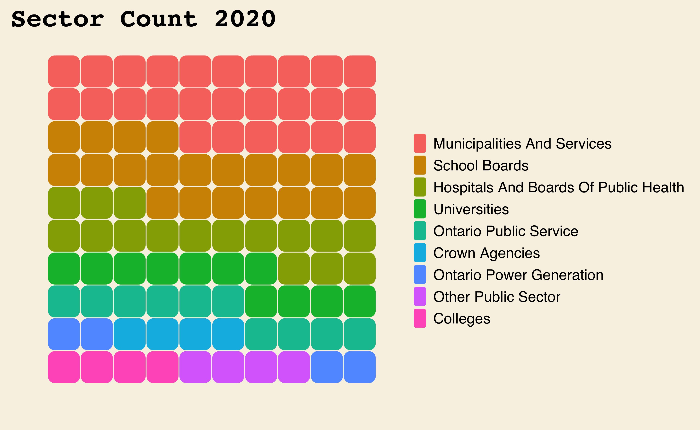
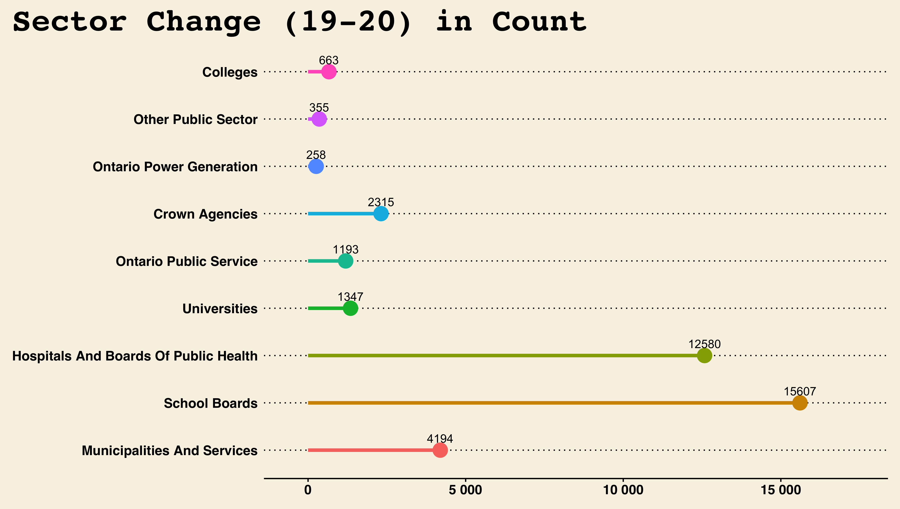
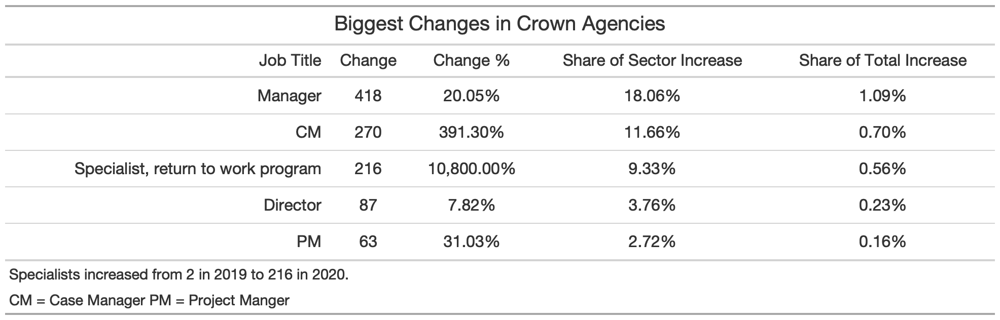
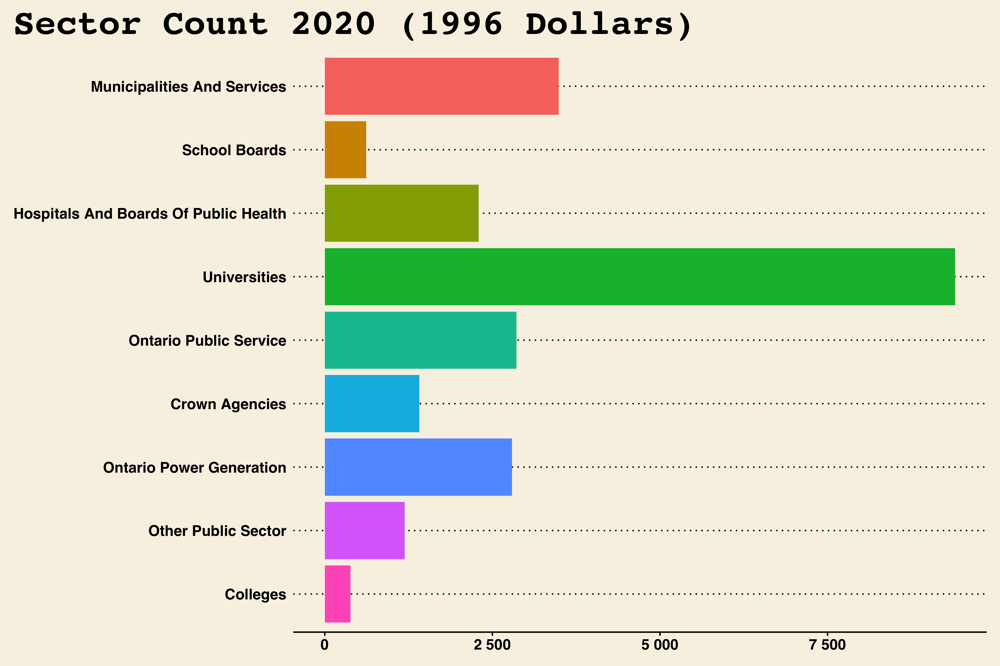
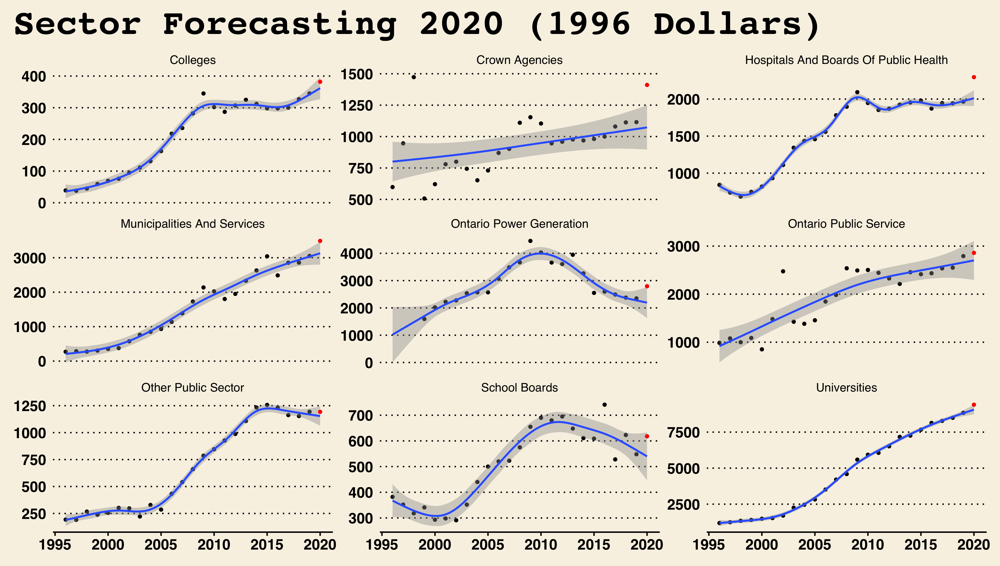
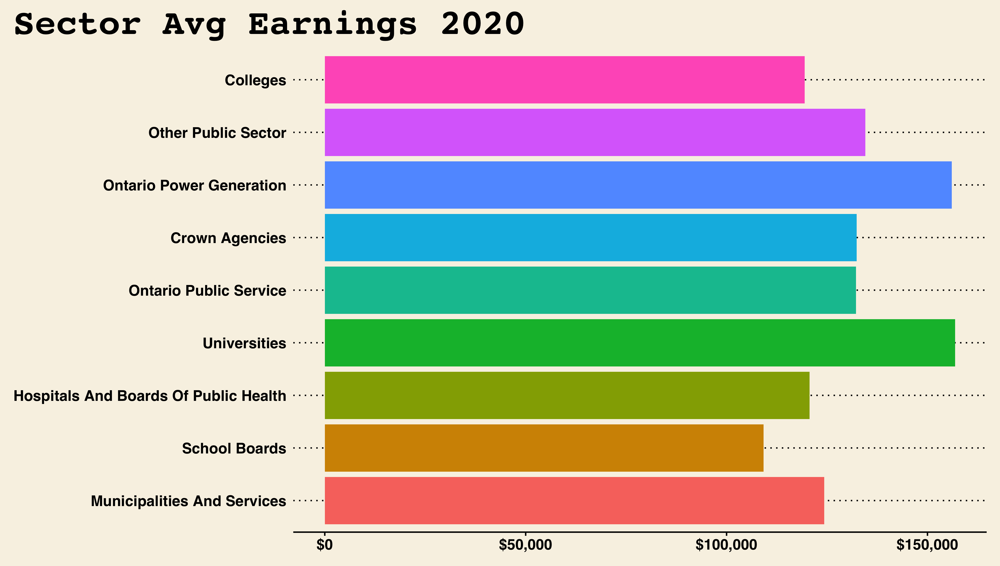
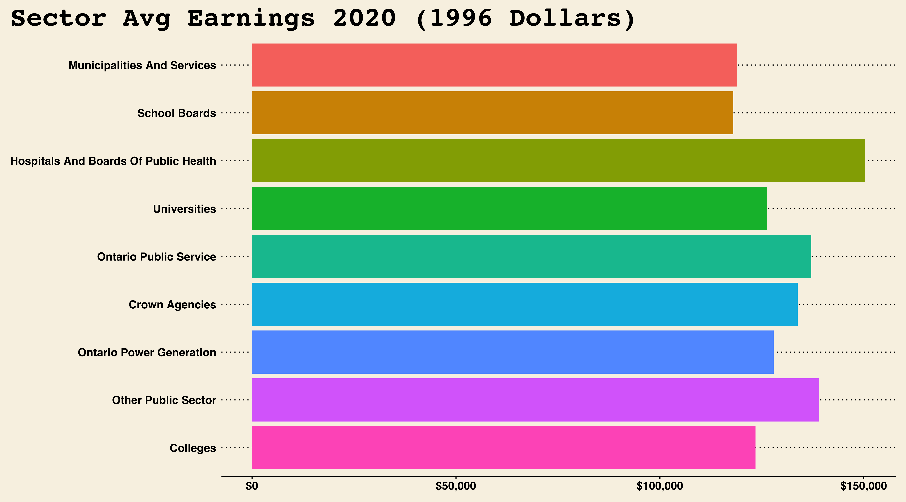

# 2020 Drastically Increased the Number of People on the Ontario Sunshine List

## An analysis of Ontario Public Sector’s “Highest” Earners

## Summary

-   The 2020 Ontario Sunshine List was released on March 19th 2021. It
    reported a total of 205,470 members, out of which 38,512 were new,
    or an increase of 23%.

-   While the list has expanded every year, this year’s growth was
    significantly larger than what the trend predicted.

-   Led by nurses and teachers, the higher-than-expected surge can be
    explained by major compensation agreements in early 2020 and the
    government’s efforts to combat the pandemic.

## This Report

<!-- descriptive statistics / PLOTS? -->

What follows is a descriptive analysis of the Ontario Sunshine List. The
main section is my attempt to shed some light on the effects of 2020 on
Ontario’s high earners. Appendix A considers what would happen if the
list’s cut-off salary was adjusted for inflation and Appendix B includes
other descriptive statistics that were not relevant to the research
question. The project is intended to be fully reproducible. If you’re
interested in replicating or improving this analysis see the README file
to get started.

## What is the OSL

A *sunshine list* is the name commonly given to the public disclosure of
employee compensation. In 1996, then premier Mike Harris, introduced the
first [Ontario Sunshine
List](https://www.ontario.ca/page/public-sector-salary-disclosure-2020-all-sectors-and-seconded-employees)
(OSL), intending to disclose the salaries and benefits of all employees
on the provincial government payroll who were considered high earners.
Setting the floor at a salary of $100,000, the province reported 4,501
high earners that year, with an average salary of $121,495.2. Dictated
by the [Public Sector Salary Disclosure
Act](https://www.ontario.ca/laws/statute/96p01a) (1996), the government
has required ever since that organizations that receive public funding
from the Province of Ontario disclose by March 31 the names, positions,
salaries and total taxable benefits of employees paid $100,000 or more
in a calendar year.

To the [criticism of
many](https://amapceo.on.ca/sunshine-list-stuck-in-past), the list’s
cut-off has remained the same since 1996, failing to account for
inflation (see Appendix A). While these renders the list a poor
comparison to its earliest iterations in terms of purchasing power, it
remains a useful tool to track broad changes in compensation trends
across the public sector.

### Uninterrupted Growth

The number of people in the Ontario Sunshine List has increased with
every release since its conception 25 years ago. It was twice as big by
2000, ten times by 2008, and today the list is 45 times larger than in
1996. Regardless, the yearly average earnings have remained mostly
constant around $127k, likely because increasing existing salaries are
compensated by new additions to the list, most of which earn a salary
close to the floor.

### Recorded by Government Sector

The data provided is categorized by government sector. While these
sectors change slightly year-to-year as a result of administrative
changes and operational restructuring (See Appendix B for a full list),
we can functionally classify all employees reported in 9 independent
groups. The following figure shows the number of people in the list
through time divided by sector.

The size of sectors vary but Municipalities have captured the highest
share of high earners for most of the list’s existence.

## 2020 in Review

The last release of the OSL reported an increase in members by a total
of 38,512 employees and a reduction in the average salary by $1,523.

### Municipalities, School-Boards and Hospitals

Municipalities, School-Boards, and Hospitals, top the share of high
earners in 2020 by a significant margin, making-up almost two thirds of
the total.

**Municipalities**

-   Police constables ($118k), managers ($129k), and firefighters
    ($117k), constituted almost a third of the job titles in
    Municipalities in 2020.

-   The average salary was $123,291.5. The highest paid positions were
    *Chief of Police* ($481k), *Chief of Police* ($436k), and *City
    Planner* ($387k).

All sectors saw the number of people making over $100k increase, but it
was School Boards and Hospitals that saw the biggest change.

**School Boards**

-   Teachers ($103k) dominated the School Board sector in 2020, making
    up 97% of jobs in the group.

-   The average salary was $109,083.8. The highest paid positions were
    *Legal Counsel* ($382k), *Director of Education* ($334k), and
    *Director of Education and Secretary-Treasurer* ($316k).

**Hospitals**

-   The sector was topped by Nurses ($110k), followed by Managers
    ($116k), and Directors ($148k).

-   The average salary was $120,083.3. The highest paid positions were
    *President and CEO* ($845k), *President and CEO* ($776k), and
    *President and CEO* ($733k).

### Job Titles

Teachers and nurses were by far the most popular jobs in the Ontario
Sunshine List of 2020. The best paying jobs in contrast went mostly to
the Ontario Power Sector with President and CEO ($1.22M), President
Nuclear ($1.13M), and CEO/Chief Nuclear Officer ($901k) as the top 3.

## Modeling Growth

Using a generalized additive model (GAM) with a Poisson distribution, I
forecast what growth in the list could have looked like if the number of
people in the list increased according to the observed trend leading to
2020.
<!-- GAMs use groups of non-linear smooth functions to capture relationships within the data. This presents a greater risk of over-fitting (or over-smoothing), as compared to linear regression, but remains a useful way to visualize trends.  -->

### Overall growth higher than expected

This model concludes that the increase in the number of people in the
OSL in 2020 was much higher than expected. While it predicted that only
190,464 public sector workers would earn more than $100k, or a growth of
14%. Instead, the list featured 205,470 members (23%), surpassing
expectations by 15,006 employees.

This fact alone may raise some eyebrows but it is important to
investigate the sources of such increase before reaching any
conclusions.

### The Culprits

We can apply the same technique for individual sectors in the list. This
allows us to identify the impact of 2020 on each sector and attempt to
determine where the above-expectations growth came from.

While earlier we learned that municipalities make up the largest share
of the list and saw one of the biggest increases of 2020, we can see
that its count is in line with our model’s predictions. Instead, when
accounting for the expected trend, Crown Agencies join School Boards and
Hospitals, in the list of sectors which growth exceeded expectations.

#### Crown Agencies

Crown Agencies make a smaller share of the list but its
higher-than-predicted growth warrants a closer look.

-   The model predicted 8,340 members but the data reported 9,332 - a
    difference of 992 employees

-   About 40% of the growth can be explained by increases in *Managers*,
    *Case Managers*, and *Specialist, return to work program*.

-   The difference is likely a result of the various agencies’ efforts
    to operate during the COVID-19 pandemic.

    -   The government has engaged on several hiring
        [rounds](https://news.ontario.ca/en/release/58807/ontario-hiring-hundreds-more-contact-tracers-and-case-managers)
        of Case Managers and Contact Tracers intending to “to help
        track, trace and isolate new cases of COVID-19”. By [January
        2021](https://news.ontario.ca/en/release/59964/ontario-expands-case-and-contact-management-workforce),
        Ontario had reported 5,600 case and contact tracers in the
        province.

    -   Specialist, return to work program, are employees in Ontario’s
        [Workplace Safety & Insurance
        Board](http://www.owa.gov.on.ca/en/returningtowork/Pages/Early-and-Safe-Return-to-Work.aspx)
        that are tasked with helping injured workers that have had
        difficulties returning to work.

    -   While I found no evidence to confirm this, I presume part of the
        increase in Managers and Specialists, occurred due to a
        heightened need for logistics and planning, and the hazardous
        nature of the pandemic on workplaces, respectively.

#### School Boards

-   The model predicted 33,994 School Board members in the 2020 list.
    Ontario reported 43,805 - a difference of 9,811 employees

-   Virtually all growth came from new to the list teachers (a shocking
    ~40% of the total increase in 2020).

-   As front-line workers, teachers in Ontario have been fully exposed
    to the dangers and impacts of the pandemic. While increased working
    hours help explain this growth, it was a major compensation
    agreement in early 2020 that was likely the main source.

    -   The 2019-2020 school year was a contract negotiation year for
        all unionized workers in School Boards in Ontario. The
        government ratified agreements with the various teacher unions
        throughout spring of 2020.

    -   The collective agreements included raises in compensation and
        benefits (given retroactively) and were negotiated with all five
        relevant
        [unions](https://news.ontario.ca/en/backgrounder/56838/ocew-central-agreement-now-ratified)
        (Ontario Council of Educational Workers (OCEW), Canadian Union
        of Public Employees (CUPE), Education Workers’ Alliance of
        Ontario (EWAO), Ontario English Catholic Teachers’ Association
        (OECTA), and the Elementary Teachers’ Federation of Ontario
        (ETFO)).

    -   Apart from the raise, it is likely that overtime and teachers
        filling in in administrative positions also contributed to the
        increase in teachers in the 2020 OSL. Also notable, the pandemic
        led to a significant rise in the number of social workers in all
        three sectors.

#### Hospitals

-   The model predicted 26,297 Hospital members in the 2020 list.
    Ontario reported 33,928 - a difference of 7,631 employees

-   Similar to School Boards, the distribution of job titles in
    Hospitals and Boards of Public Health is skewed towards one
    profession. Nurses made up more than 70% of the sector increase in
    2020 and almost a quarter of the total growth.

-   The provincial government has been expanding their nursing staff
    since [mid
    2020](https://news.ontario.ca/en/release/58580/ontario-investing-525-million-to-recruit-retain-and-support-more-health-care-workers).
    Alongside it, a [pandemic pay
    bump](https://www.ontario.ca/page/covid-19-temporary-pandemic-pay)
    given to health care workers in the fall, as well as overtime hours
    in dealing with the pandemic, explain the drastic increase.

-   In line with the health implications of COVID-19, we see the number
    of respiratory therapists on the list rose by 300% from 2019.

## Conclusion

There is only so much we can extrapolate from this limited information.
While we can conclude that the increment observed was higher than
normal, and this was due to very large increases in the number of
teachers and nurses, it is impossible to determine whether the decisions
behind such changes were appropriate, successful, or efficient.

Many argue that the list’s floor should be raised according to inflation
(see Appendix A), whereas other countries like
[Norway](https://www.bbc.com/news/magazine-40669239) have opted for full
transparency in the public sector. It is clear that the cut-off, as it
exists now, does more to confuse than clarify. $100k dollars, while far
from the median ($37,500 as of
[2019](https://www150.statcan.gc.ca/t1/tbl1/en/tv.action?pid=1110023901&pickMembers%5B0%5D=1.8&pickMembers%5B1%5D=2.1&pickMembers%5B2%5D=3.1&pickMembers%5B3%5D=4.1&cubeTimeFrame.startYear=2000&cubeTimeFrame.endYear=2019&referencePeriods=20000101%2C20190101)),
covers too broad of a stroke to facilitate insights on the highest
earners, but too narrow to attempt to investigate broad changes in the
public sector. In fact, most of the reporting that follows the list’s
release, focuses seldomly on the individuals earning the highest
salaries (like
[CTV](https://toronto.ctvnews.ca/ontario-s-2020-sunshine-list-revealed-here-are-the-people-who-got-paid-the-most-1.5354551)
or
[CBC](https://www.cbc.ca/news/canada/toronto/ontario-2020-sunshine-list-1.5957158)).
This is important information, but one that fails to give us any
valuable big-picture insights.

Further analysis on the OSL is welcomed, with interesting research
questions like contrasting trends through time with electoral cycles or
economic fluctuations, investigating income distributions across
sectors, or even a longitudinal analysis that follows individuals over
years.

<!-- Earnings trends across sectors and job titles, could also reach useful insights about the income distribution of Ontario's public sector.  -->

------------------------------------------------------------------------

------------------------------------------------------------------------

# Appendix A - Adjusting for Inflation

The OSL is criticized for using the same cut-off at $100K that it began
with, instead of adjusting for inflation. Any analysis that intends to
learn more about Ontario’s highest earners, needs to account for the
difference in purchasing power between 1996 and 2020. If we were to
adjust for inflation, the floor today should sit at $156,916.

### Only 22% Remain

By adjusting all salaries to 1996 dollars (using Ontario CPI All-items
values from [Stats
Can](https://www150.statcan.gc.ca/t1/tbl1/en/tv.action?pid=1810000413)),
we can identify how the list would have changed in the presence of a
moving floor. While the list containing all years available houses
1,674,697 recorded salaries, when adjusting for inflation only 370,803
remain, or the equivalent to 22.1%.

### 2020 Using an Adjusted Cut-Off

The 2020 list shrinks by 88.1% when adjusting for inflation, totaling
only 24,444 members.

This analysis shows that at the higher cut-off, universities dominate
the list and have done so for quite some time. This is likely due to the
nature of the sector, where the majority of its members are professors.
The average salary of an Ontario Professor in the 2020 OSL is $167k
compared to nurses at $110k and teachers at $103k

Matched only at first by Ontario Power Generation, Universities begin
dominating the list using an adjusted cut-off around 2006. While all
other sectors have remained mostly constant for the past ten years, only
Universities (and Municipalities to a far lesser extent) have
experienced a steady growth.

### Modeling the List of Really High Earners

Adjusting the cut-off virtually means reducing the list to the very high
earners. Repeating the exercise, we model growth using a GAM on the
trend leading to 2020.

Similarly, we see an increase higher than expected though with larger
margins of error.

When eliminating those making between $100k and $156k from the list, the
trends get messier. The model indicates that all but the Crown Agencies
and Hospital sectors saw growth in line with projections.

-   The increase in Crown Agencies came from Directors ($187k) and
    Managers ($189)

-   The increase in Hospitals came from Directors ($186k), Nurses
    ($176k), and Pathologists ($311k)

------------------------------------------------------------------------

------------------------------------------------------------------------

# Appendix B - Supplemental Information

The following is a collection of charts and tables that are not relevant
for the research question and as such are presented with little context.

### Breakdown of Sectors Through the Years

### Ratio of Management versus Professional Job Titles

Comparing the ratio of management and professional job titles in the
2020 OSL suggests that around 1/3 of the list is made up of managers. As
expected, when adjusting the cut-off point, the ratio goes up to 40:60.

### Average Earnings by Sector

#### In 2020

#### Through Time

#### Adjusting for Inflation

