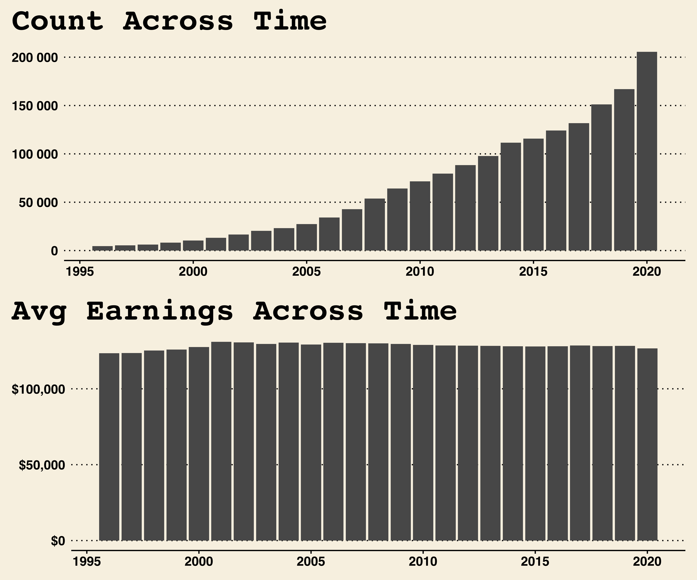

# The Pandemic's Effect on Ontario Public Sector's High Earners 

## This Report (Issue)

## What is the OSL (Background)

### 24 Years of Data

### 9 Governement Sectors

 

### COVID-19 in Ontario 

## 2020 in Review (Context)

### Municipalities, School-Boards and Hospitals

 

## Exceeding Projections (Analysis)

### Overall Growth

### The Culprits

## Adjusting for Inflation (Considerations)

### Only 8% Remain

### Universities, Universities, Universities

### Actual vs Projected with Adjusted Cut-Off… things get messy

## Conclusion

# Appendix
